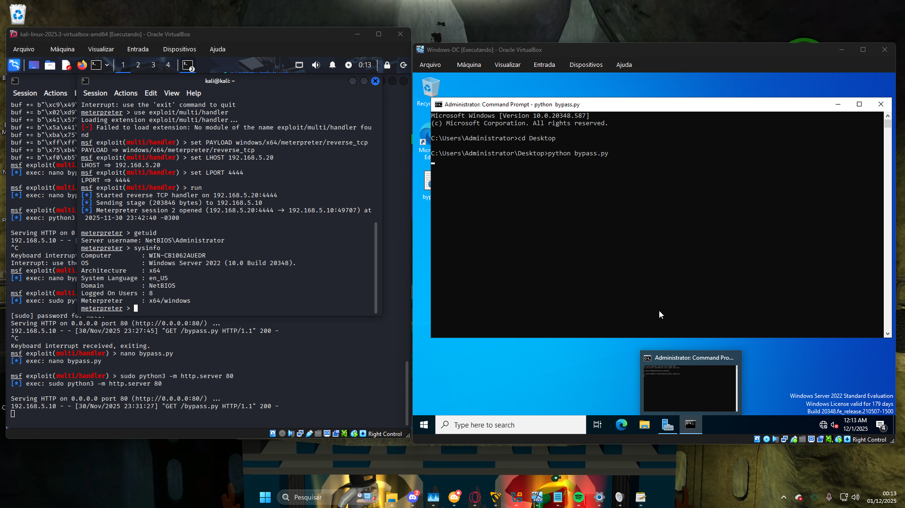
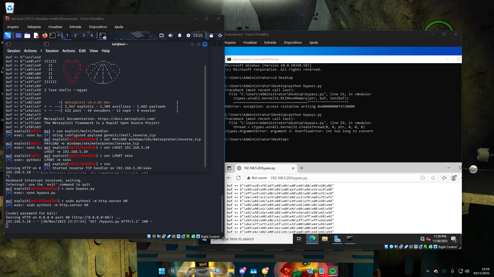

# AV Evasion: Bypassing Windows Defender com Python 🛡️➡️🐍

Neste laboratório avançado de Red Team, explorei técnicas de **Evasão de Defesa** para executar código arbitrário (Reverse Shell) em um servidor Windows Server 2022 com o Windows Defender ativado.

O objetivo foi demonstrar como atacantes utilizam linguagens interpretadas e injeção de memória para contornar assinaturas estáticas de antivírus.

## ⚙️ Técnica Utilizada: In-Memory Injection
Em vez de usar um executável (`.exe`) compilado pelo Metasploit (que é facilmente detectado), criei um *loader* customizado em Python.

1.  **Shellcode:** Gerei um payload reverso em formato *raw shellcode* (hexadecimal).
2.  **Injeção:** Utilizei a biblioteca `ctypes` para interagir diretamente com a API do Windows (`kernel32.dll`).
3.  **Execução:** Aloquei memória (`VirtualAlloc`), movi o shellcode e criei uma thread para rodar o payload direto na RAM.

### 📸 Prova de Conceito (PoC)
A imagem abaixo comprova o sucesso da evasão. O script foi executado, o Windows Defender não detectou ameaça, e uma sessão Meterpreter foi aberta com privilégios de Administrador.



## 🔧 Desafios & Troubleshooting
A execução de injeção de memória em sistemas 64-bit apresentou desafios específicos de compatibilidade com a biblioteca `ctypes`.

**O Problema:**
Ao executar o script inicial, recebi o erro `OSError: exception: access violation writing...` e `OverflowError`. Isso ocorreu porque o Python estava tentando tratar endereços de memória de 64-bit como inteiros de 32-bit, causando falha na alocação.



**A Solução:**
Foi necessário definir explicitamente os tipos de argumentos (`argtypes`) e retorno (`restype`) das funções da API do Windows para garantir compatibilidade com ponteiros de 64-bit:
```python
ctypes.windll.kernel32.VirtualAlloc.restype = ctypes.c_void_p
ctypes.memmove(ptr, buf, len(buf)) # Uso de memmove para segurança
