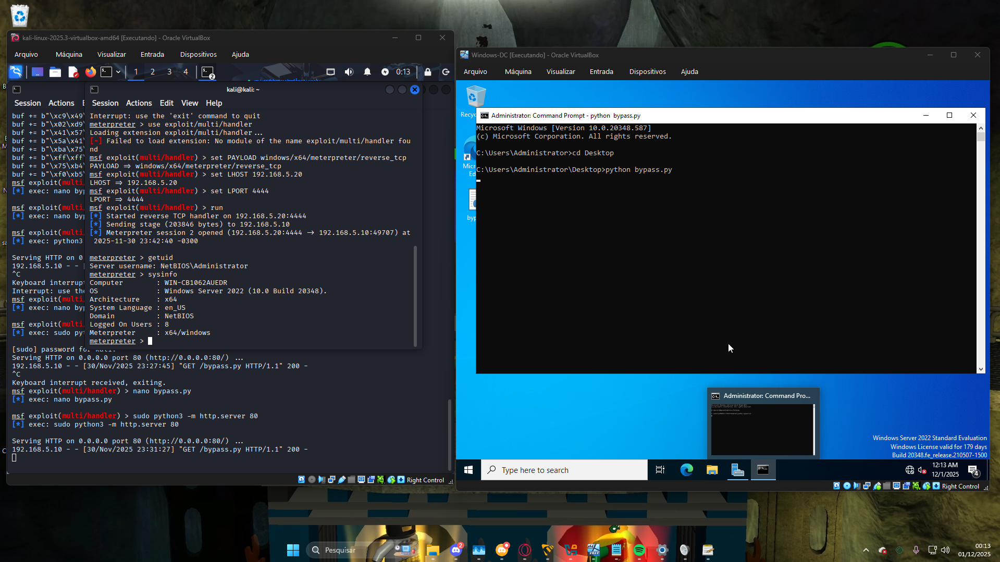

# AV Evasion: In-Memory Shellcode Injection com Python 🛡️➡️🐍

Este laboratório foca em técnicas de Red Teaming para evasão de soluções de segurança (EDR/AV), especificamente o Windows Defender em ambiente Windows Server 2022. A estratégia central foi a execução de código arbitrário via injeção direta em memória para evitar a detecção estática de arquivos maliciosos em disco.

## Metodologia: In-Memory Injection
Para contornar assinaturas baseadas em arquivos (.exe maliciosos), desenvolvi um loader customizado em Python que utiliza a biblioteca `ctypes` para interagir com a WinAPI.

1. **Vetor de Ataque:** Geração de shellcode reverso em formato raw (hex).
2. **Alocação de Memória:** Uso da função `VirtualAlloc` do `kernel32.dll` para reservar um espaço de memória com permissões de leitura, escrita e execução (RWX).
3. **Injeção e Execução:** Movimentação do shellcode para o espaço alocado via `RtlMoveMemory` e criação de uma thread de execução com `CreateThread`.

### Prova de Conceito (PoC)
O script foi executado com sucesso sem disparar alertas do Windows Defender. O resultado foi o estabelecimento de uma sessão Meterpreter estável com privilégios administrativos.



## Debugging e Compatibilidade (x64)
O principal desafio técnico surgiu na transição para arquiteturas de 64 bits, onde a manipulação de ponteiros via `ctypes` exige definições rigorosas.

**Causa Raiz:**
Ocorreram falhas de `Access Violation` e `OverflowError` devido ao Python tratar endereços de memória de 64 bits como inteiros de 32 bits por padrão, resultando em referências de memória inválidas durante a alocação.

**Resolução:**
Foi necessário tipar explicitamente os retornos e argumentos das funções da API do Windows para suportar ponteiros de 64 bits (LPVOID):

```python
import ctypes

# Definição de tipos para compatibilidade x64
kernel32 = ctypes.windll.kernel32
kernel32.VirtualAlloc.restype = ctypes.c_void_p
kernel32.VirtualAlloc.argtypes = [ctypes.c_void_p, ctypes.c_size_t, ctypes.c_uint32, ctypes.c_uint32]
```

## Conclusão Técnica
A prática demonstra que loaders em linguagens interpretadas como Python continuam sendo vetores eficazes de pós-exploração. Ao evitar a escrita de artefatos binários conhecidos no sistema de arquivos, é possível realizar o bypass de defesas perimetrais e focar na execução in-memory.

---
*Projeto focado em Red Teaming e Evasão de Defesa.*
